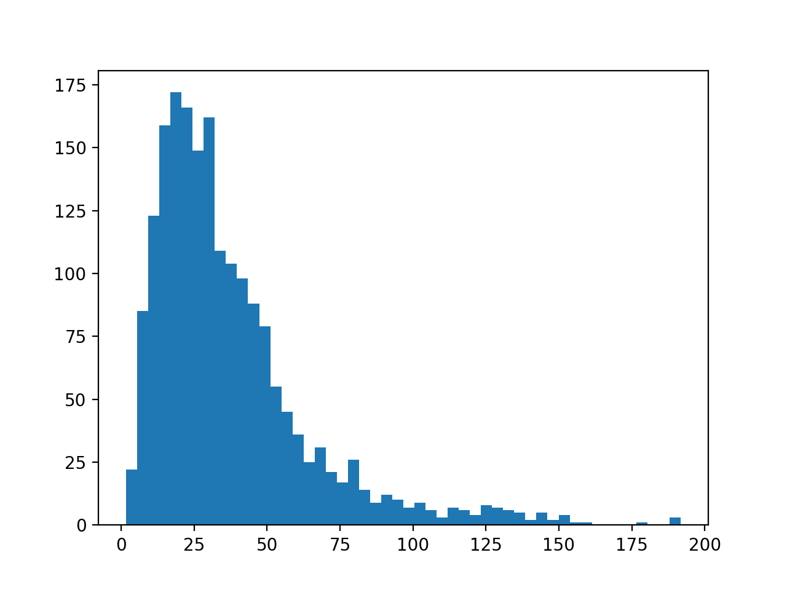
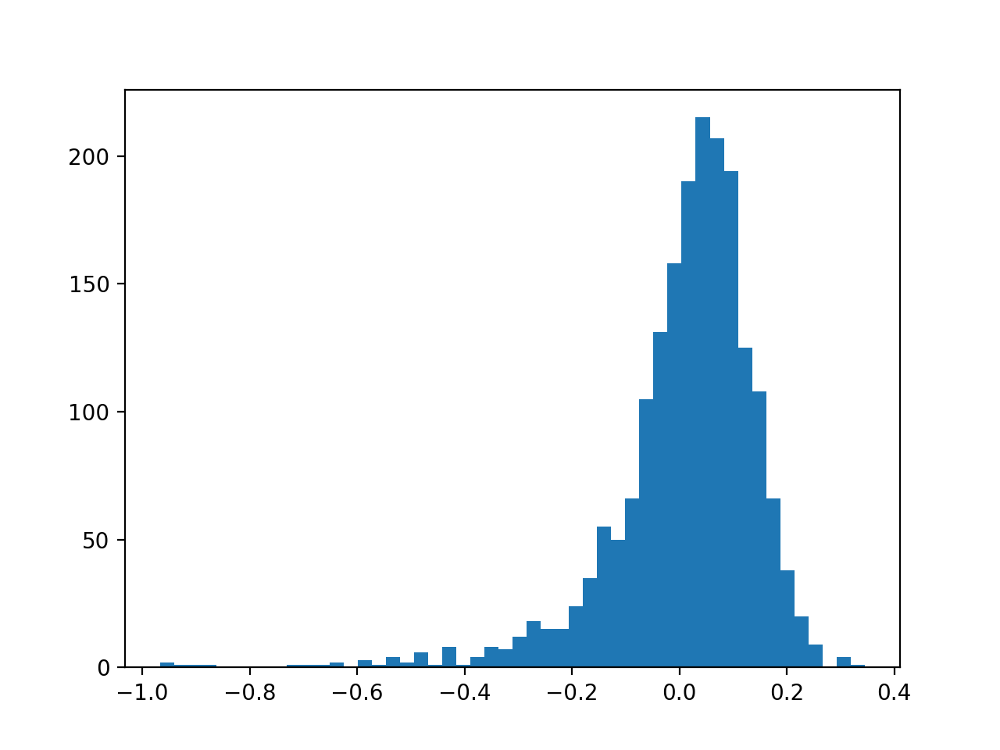
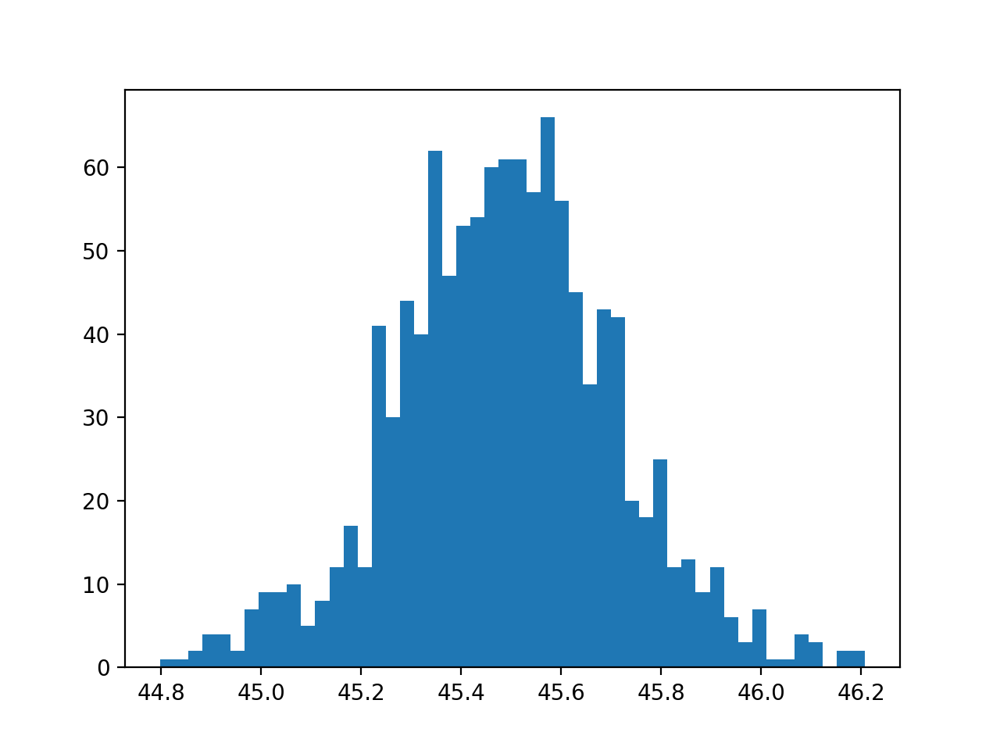
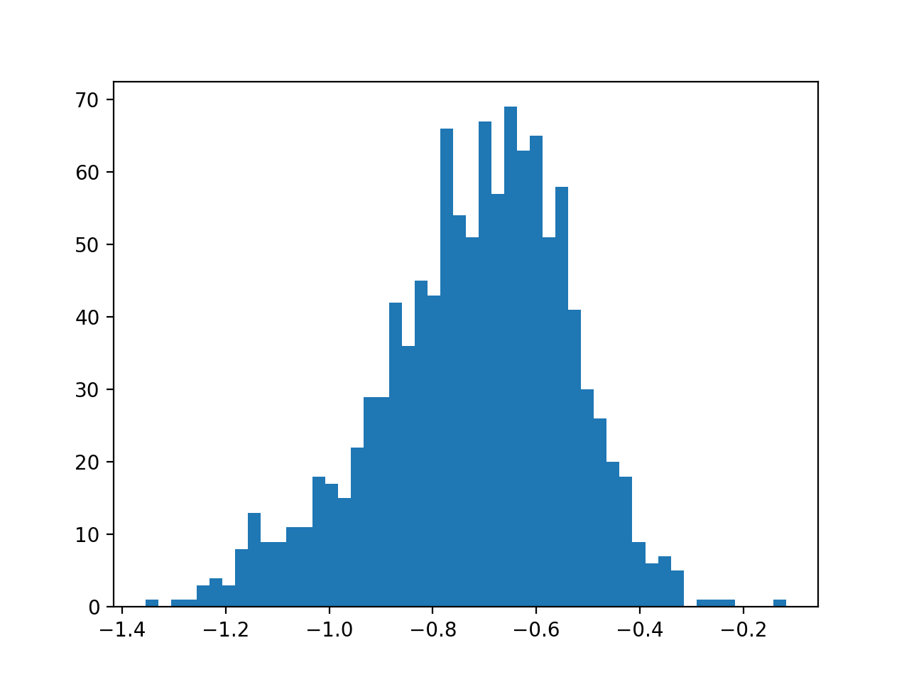

## 筛选

筛选红移区间 0-0.8 (15756)，热光度大于 10^46erg/s (1927) 的源 (1922)

## 拟合

参数      | 限制
:-------:|:-----:
热尘埃温度| 500 - 2000K
消光参数  | -inf - 0.5

误差棒考虑了零点误差。

残差

mean = 45.732317091822836
median = 29.91874666968944

之前的结果对比：

消光参数

mean = 0.0045412057700914684
median = 0.03359024202625518

## 残差 150 以上的几个拟合

## 筛选

接着筛去残差大于 50 或消光参数小于 -0.1 的源 (1305)

## 计算

使用 3000 埃处光度计算热光度，并与数据集中的热光度对比：

筛去算得热光度小于 10^46 erg/s 的源 (1137)

将红外成分从 1um 到 10um 积分得到近红外光度：

计算出 covering factor

covering factor 与 oiii 线等值宽度直接相关系数为 -0.133，
偏相关系数为 -0.139。

红外成分从 1um 到 10um 逐点的光度计算的 covering factor 与 oiii_5007 等值宽度的偏相关系数（另外两个变量是由拟合结果计算处的热光度和由 Hbeta 线计算出的黑洞质量）

$\lambda=2.65\mu m$ 处偏相关系数最小为 -0.200，$\lambda=8.53\mu m$ 处偏相关系数最大为 -0.023，如下图

如果使用数据集中直接由连续谱光度推出的热光度数据，得到相关性会显著偏高，偏相关系数对比图如下：

## 模拟

使用原始数据的协方差矩阵对每个源重新生成 oiii 等值宽度和 covering factor 数据，使用新的参数计算出模型，再由模型计算出每个波段测光数据，最后再给每个测光数据添加一个原始数据到模型的差值大小的偏差。利用生成的数据重新做拟合：

残差：

消光：

可以看到两者分别在 50 处和 -0.1 处有明显的截断，这是对数据的筛选导致的，这同时也说明了生成的数据与原始数据相似。

