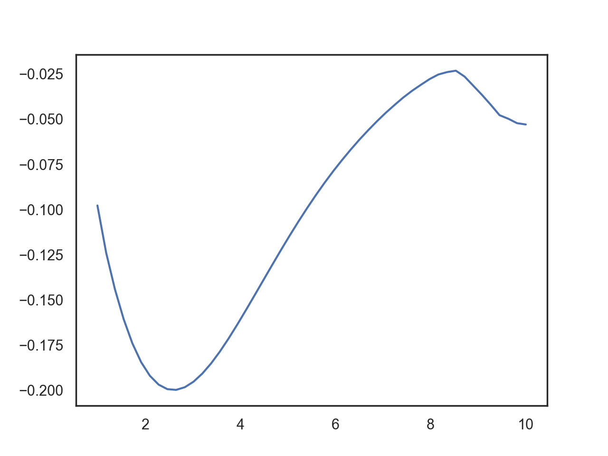

## 筛选

筛选红移区间 0-0.8 (15756)，热光度大于 10^46erg/s (1927) 的源。

## 拟合

参数      | 限制
:-------:|:-----:
热尘埃温度| 500 - 2000K
消光参数  | -inf - 0.5

误差棒考虑了零点误差。

残差

mean = 45.732317091822836
median = 29.91874666968944

之前的结果对比：

消光参数

mean = 0.0045412057700914684
median = 0.03359024202625518

## 残差 150 以上的几个拟合

## 筛选

接着筛去残差大于 50 或消光参数小于 -0.1 的源 (1310)

## 计算

使用 3000 埃处光度计算热光度，并与数据集中的热光度对比：

将红外成分从 1um 到 10um 积分得到近红外光度：

计算出 covering factor

红外成分从 1um 到 10um 逐点的光度计算的 covering factor 与 oiii_5007 等值宽度的偏相关系数

