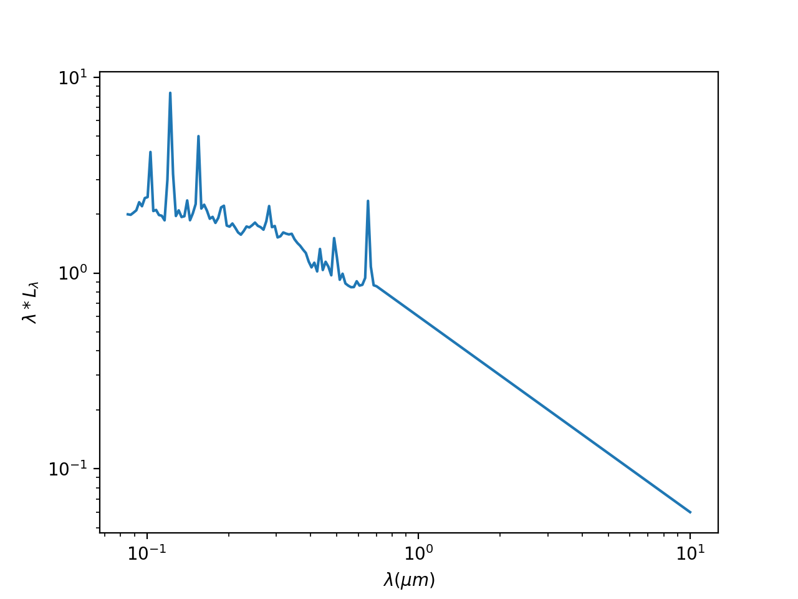
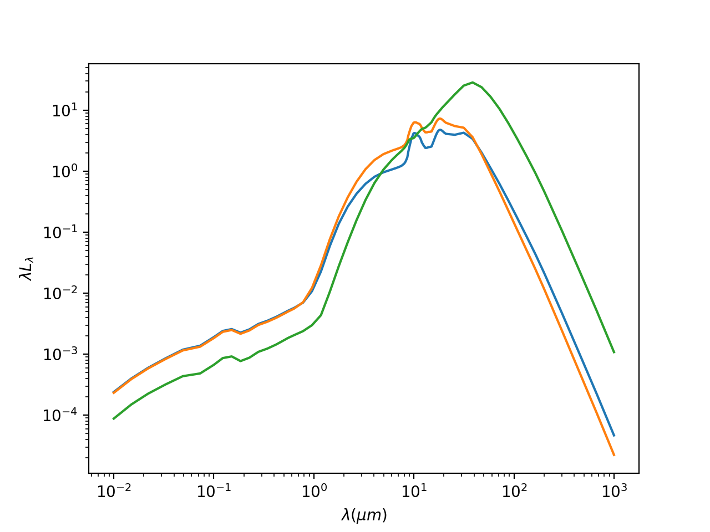
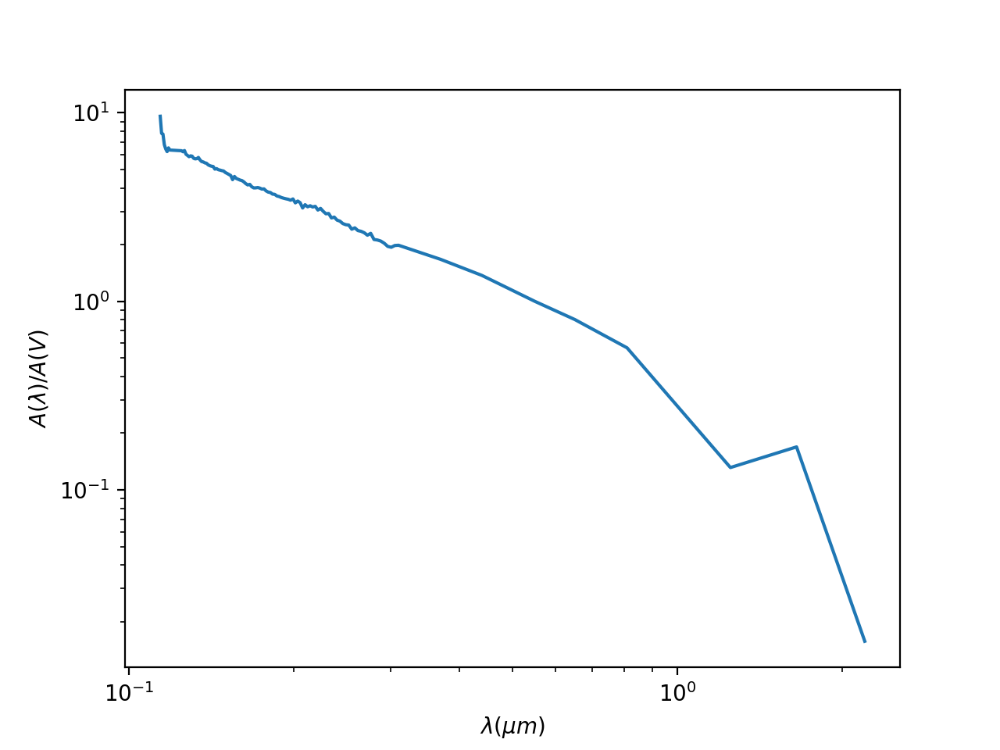
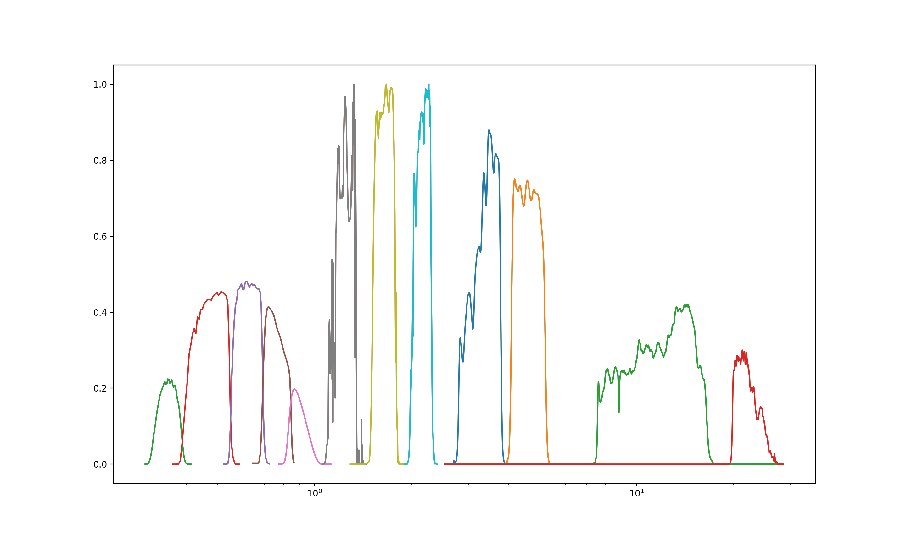

## 数据

本工作用到的类星体测光数据和发射线数据来自于沈越 2011 年发布的 SDSS DR7 数据集（shen et al. 2011）。

## 数据筛选

SDSS 的光谱数据波长范围约为 4000 埃到 9000 埃，为使所分析的发射线有观测并且数据较为准确，针对不同发射线挑选不同红移区间使得发射线落入 SDSS 光谱波长中心处。具体数据为：

发射线 | 红移下限 | 红移上限
:-:   | :-:     | :-: 
h_beta | 0      | 0.875
oiii_5007 | 0   | 0.8
mgii   | 0.786  | 1.858
civ    | 2.228  | 4.165

## SED 模型

用于拟合的 SED 模型分为三部分：吸积盘辐射，热尘埃辐射，冷尘埃辐射。

### 吸积盘辐射

吸积盘辐射成分分为两部分，从 500 埃到 7000 埃使用 Zhaohui Shang et al. 2011 的射电静 AGN SED 模板，这个模板是 Elvis et al. 1994 的改进，使用了更高质量的 AGN 数据，与 Elvis et al. 在大体形状上相似但有更高的光谱分辨率，同时模板中还包含了各条发射线。大于 7000 埃的部分近似为一个指数为 -1 的 power law，与前一部分在 7000 埃处平滑连接。

### 热尘埃辐射

热尘埃指尘埃环内壁的尘埃，其温度为尘埃的升华温度，大约是 1500K，因此使用一个黑体辐射谱来近似。

### 冷尘埃辐射

冷尘埃辐射是尘埃环内相对靠外的温度较低的尘埃所发出的辐射，由于其不是单一温度不能使用黑体辐射来近似。Nenkova et al. 2008 对不同参数的尘埃环提供了大量模板，但由于我们的模型在长波处只有 WISE 的测光数据，无法对这些参数作拟合。Roseboom et al. 2013 通过对大量数据的拟合确定出了三个能够使残差最小的尘埃模板。对每个源我们都会使用这三个模板分别拟合并选取残差最小的结果。

### 尘埃消光

除了以上三个成分外，我们还在光谱上叠加了一个尘埃消光成分，使用 SMC 的消光曲线作为模板。

## 拟合

用以拟合的数据为 SDSS 的 ugriz 五个波段，2MASS 的 jhk 三个波段和 WISE 的 W1 W2 W3 W4 四个波段的测光数据，各波段的相对光谱响应（Relative Spectral Sponse, RSR）如下图所示：

将 SED 与光谱响应函数相乘并积分即可求得相应波段的测光结果，拟合问题即为一个最优化问题：求使得 $\chi^2$ 最小的各光谱参数。拟合使用 `astropy.modeling` 完成。

